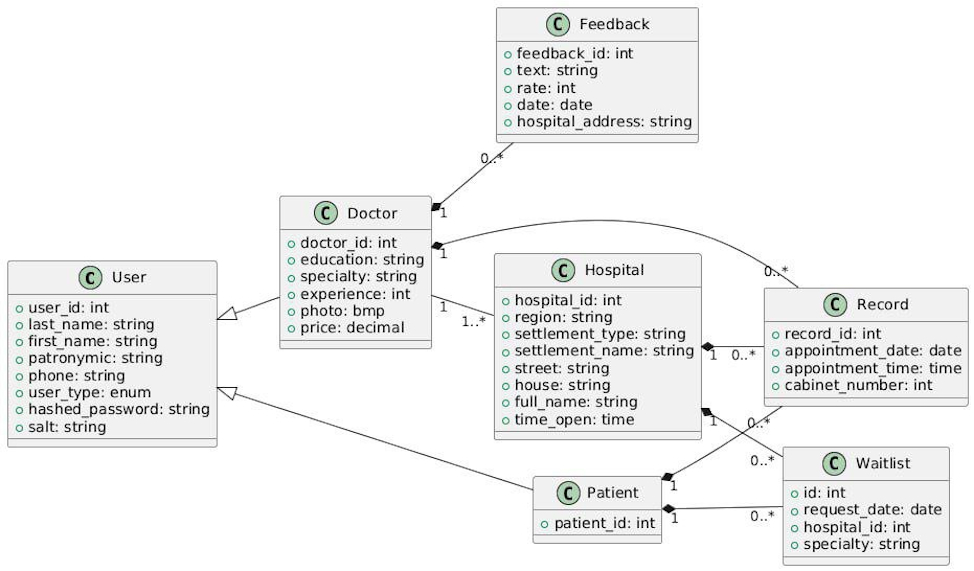
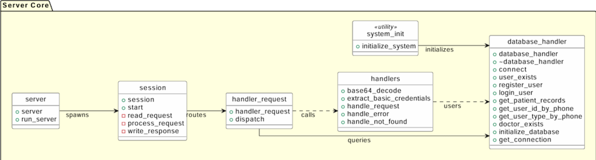
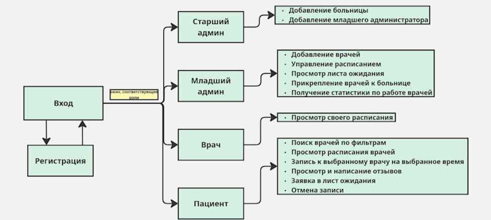

## MedScheduler
**Сервис по поиску врачей и записи на прием.**

**Авторы**: ```Бальжиев Аюр```, ```Грудцына Виктория```, ```Толстограева Виктория```

## Описание проекта

**MedScheduler** — это клиент-серверное медицинское приложение и веб-сервис, предназначенные для управления записями на приём к врачам. Система поддерживает ролевую модель доступа с разделением прав между следующими категориями пользователей: пациенты, врачи, а также администраторы клиник и системы. 

**Основная функциональность MedScheduler**:
- Для пациентов:
  - Поиск врачей по фильтрам  
  - Запись на приём и оставление заявки на занятый слот 
  - Просмотр отзывов  
- Для врачей:
  - Просмотр расписаний со всех мест работ
  - Доступ к данным пациентов
- Для администраторов больниц:
  - Формирование статистики по работе специалистов  
  - Управление расписанием клиники  
  - Управление врачами  
- Для администраторов приложения:
  - Работа с данными пользователей  
  - Создание клиник  
  - Назначение администраторов медучреждений

## Познакомьтесь с нами ближе!
<table width="100%" style="table-layout: fixed;">
  <colgroup>
    <col width="60%" />
    <col width="40%" />
  </colgroup>
  <tr>
    <th align="center"><strong>Приложение</strong></th>
    <th align="center"><strong>Веб-сервис</strong></th>
  </tr>
  <tr>
    <td align="center">
      <a href="https://github.com/SanriaArgos/MedScheduler/releases">Скачать MedScheduler</a><br/>
      <em>Для запуска перейдите в MedScheduler.zip → release → exe</em>
    </td>
    <td align="center">
      <a href="https://www.medscheduler.ru/">Перейти на сайт MedScheduler</a>
    </td>
  </tr>
</table>


## Технологии

Проект MedScheduler реализован на языке C++, охватывая как серверную логику, так и клиентский интерфейс.

<table>
  <tr>
    <th colspan="2" align="center">Основные технологии и инструменты</th>
  </tr>
  <tr>
    <th>Компонент</th>
    <th>Технологии / Инструменты</th>
  </tr>
  <tr>
    <td><strong>Серверная часть (C++)</strong></td>
    <td>Boost.Beast (HTTP сервер), libpq (работа с PostgreSQL)</td>
  </tr>
  <tr>
    <td><strong>Клиент (C++)</strong></td>
    <td>Qt6.8.2 (графический интерфейс)</td>
  </tr>
  <tr>
    <td><strong>Фронтенд</strong></td>
    <td>Next.js (SSR и маршрутизация), React (компонентная архитектура), TailwindCSS (утилитарная стилизация)</td>
  </tr>
  <tr>
    <td><strong>База данных</strong></td>
    <td>PostgreSQL</td>
  </tr>
  <tr>
    <td><strong>Инфраструктура и DevOps</strong></td>
    <td>Docker; Nginx (reverse proxy и SSL-терминация); Certbot; виртуальная машина в Yandex.Cloud</td>
  </tr>
  <tr>
    <td><strong>CI/CD</strong></td>
    <td>GitHub Actions (автоматическая сборка, деплой и обновление)</td>
  </tr>
  <tr>
    <td><strong>Тестирование</strong></td>
    <td>Postman (ручное тестирование API)</td>
  </tr>
</table>


## Архитектура

Система построена по модульному принципу с использованием контейнеризации:

- Серверное приложение, база данных и фронтенд развернуты в отдельных Docker контейнерах на виртуальной машине с Ubuntu в Yandex.Cloud. 
- Для обработки и маршрутизации входящих HTTP/ HTTPS запросов используется reverse proxy Nginx, который:
  - Принимает все запросы от клиентов;
  - Маршрутизирует запросы к API серверу или фронтенду;
  - Обеспечивает SSL-терминацию с использованием сертификатов, полученных через Certbot, гарантируя защищённое HTTPS соединение.

## Деплой и CI/CD

Процесс автоматического деплоя реализован с помощью GitHub Actions и включает следующие этапы:

- При пуше в ветку `main` запускается пайплайн деплоя.
- Для серверной части и базы данных выполняется:
  - Сборка Docker образов,
  - Передача архивов с образами на сервер через SSH,
  - Остановка текущих контейнеров и запуск новых с обновлёнными версиями.
- Для фронтенда:
  - Сборка и упаковка веб-приложения,
  - Копирование собранных файлов на сервер,
  - Сборка и запуск Docker контейнера фронтенда.

## Безопасность

- Применяется механизм базовой аутентификации (Basic authentication).
- Пароли пользователей хранятся в базе данных в виде хешей, полученных с применением алгоритма SHA-256 и уникальной соли для каждого пользователя.
- Все данные передаются по защищённому протоколу HTTPS, обеспечивающему шифрование и целостность информации во время сетевого взаимодействия.


## Структура проекта
| **Схема взаимодействия объектов в базе данных**<br> |
|:--:|

| **Схема серверной части приложения**<br> |
|:--:|

| **Схема клиентского приложения**<br> |
|:--:|

| **API-документация**                                                                 | **Карта веб-сервиса**                                                            |
|:----------------------------------------------------------------------------------------:|:------------------------------------------------------------------------------:|
| [Перейти к описанию API](https://www.medscheduler.ru/api-documentation)                  | [Перейти к карте сайта](https://www.medscheduler.ru/site-map)                  |


## Тестирование API

Для верификации корректности работы API сервиса предусмотрена коллекция тестов для Postman. 

### 1. Предварительные требования

- Установленный [Postman](https://www.postman.com/downloads/)
- Доступ к серверу API (удаленному или локальному)

### 2. Инструкция по запуску тестов


#### 3. Импорт коллекции тестов

1. Откройте интерфейс Postman
2. Нажмите кнопку `Import` в левом верхнем углу
3. Выберите файл `tests_for_MedScheduler.postman_collection.json`
4. Подтвердите импорт коллекции

#### 4. Настройка окружения

1. Создайте новое окружение через меню `Environments` 
2. Добавьте переменную окружения:
   - Имя: `base_url`
   - Значение: `https://api.medscheduler.ru` (или `http://localhost:[PORT]` для локального тестирования)
3. Сохраните изменения

#### 5. Выполнение тестов

1. Откройте импортированную коллекцию
2. Нажмите кнопку `Run collection`
3. В диалоговом окне выберите созданное окружение
4. Запустите выполнение тестов
